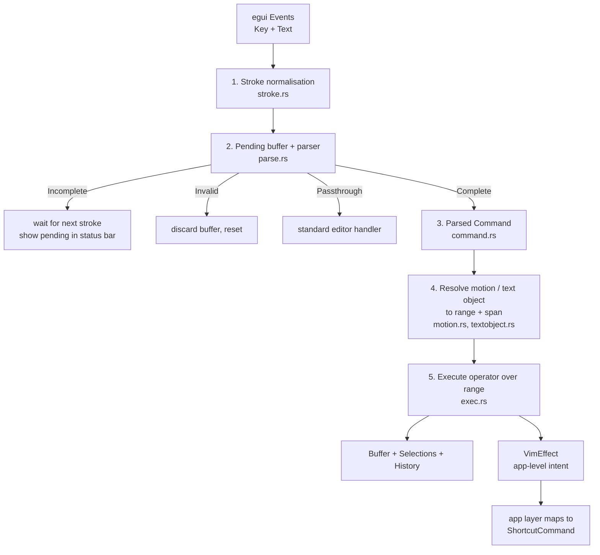

# Vim Mode — Design for Fuller Keybindings and an Ex Command Subset

**Status:** **Implemented** — phases 0–4 shipped; phase 5 (Visual Block, macros) not started.
`src/editor/ferrite/vim.rs` is replaced by `src/editor/ferrite/vim/`.
**As-built reference:** [`docs/technical/editor/vim-mode.md`](technical/editor/vim-mode.md) — the shipped keymap.
**Binding constraints:** [`docs/technical/editor/architecture.md`](technical/editor/architecture.md) — complexity tiers, no per-frame O(N).

> **Where the implementation departed from this design.** Three things changed once the code
> met the codebase, and they are corrected in place below rather than left as a trap for the
> next reader:
>
> 1. **§2.5** proposed putting `EditHistory`, search state and the clipboard inside `VimCtx`.
>    None of the three belong to the editor, so all became effects instead.
> 2. **§1.3** claimed Vim edits were invisible to the undo history. They are not — the
>    widget's per-frame snapshot diff already captured them, so `dd` + Ctrl+Z worked before
>    this change. Only the Vim *keys* for undo were missing.
> 3. **§3.1** listed `Ctrl+D/U/F/B` as page motions. Ferrite already binds Ctrl+D to Delete
>    Line, Ctrl+F to Find and Ctrl+B to Bold, so those are left to the application and paging
>    stays on PageUp/PageDown.

## The question this answers

> Is there a better way to support a more complete set of vi/vim key bindings, and
> potentially a subset of commands to run?

Yes — but not by adding match arms to the current dispatcher. The present design has a
**hard ceiling** that no amount of incremental work gets past, and the ceiling is reached
already. This document establishes where the ceiling is, why it exists, and the smallest
restructuring that removes it.

The short version: stop dispatching on `egui::Key`, start parsing a **stream of
keystrokes** against a **grammar**, and separate *what the user asked for* (a parsed
command) from *how it is carried out* (a range plus an operator). That is how vim itself is
structured, and it is the reason vim's keymap composes instead of enumerating.

---

## 1. Why the current design cannot grow

### 1.1 The blocking problem: `egui::Key` cannot spell vim

`VimState::handle_key()` dispatches on `egui::Key` plus a `shift` flag. egui 0.34's `Key`
enum simply **has no variant** for most of vim's command characters. Verified against
`egui-0.34.2/src/data/key.rs`:

| Vim command | Character | `egui::Key` variant | Consequence today |
|---|---|---|---|
| End of line | `$` | **absent** | Faked with `Key::End` |
| First non-blank | `^` | **absent** | Unreachable |
| Matching bracket | `%` | **absent** | Unreachable |
| Search word under cursor | `*` / `#` | **absent** | Unreachable |
| Toggle case | `~` | **absent** | Unreachable |
| Indent / dedent | `>` / `<` | **absent** | Unreachable |
| Sentence motion | `(` / `)` | **absent** | Unreachable |
| Soft-BOL motions | `_` | **absent** | Unreachable |

`Colon`, `Slash`, `Questionmark`, `Semicolon`, `Comma`, `Quote`, `OpenCurlyBracket` and
`CloseCurlyBracket` *do* exist, so `:` `/` `?` `;` `,` `{` `}` are reachable — but the set is
arbitrary from vim's point of view, and it is not portable. egui documents `Key` as *"most of
the time, the logical key, heeding the active keymap"*. Whether `$` arrives as
`Key::Num4 + shift`, as some other logical key, or not at all is a function of the user's
keyboard layout and the platform integration. On a German, French, or Dvorak layout the
mapping differs. **A keymap keyed on `Key` is a keymap that only works on the layout the
developer happened to test.**

Meanwhile `Event::Text` — which carries the actual character the user typed, already layout-
and IME-resolved — is *discarded* in Normal and Visual mode:

```rust
// editor.rs, current behaviour
if let egui::Event::Text(_) = event {
    if !self.vim_state.should_insert_text() {
        continue;   // ← the entire command alphabet is thrown away here
    }
}
```

The character stream vim needs is being computed by egui, delivered to Ferrite, and dropped
one line before use.

### 1.2 There is no grammar, so nothing composes

Vim's keymap is not a list of bindings; it is a small language:

```
[register] [count] operator [count] (motion | text-object)
```

`d2w`, `2dw`, `"ay$`, `ci"`, `>3j`, `d/foo` are all the *same rule* with different
terminals. The current code models this with a single `Option<PendingOperator>` and an
`(operator, key)` match, which yields exactly six working combinations — `dd`, `dw`, `yy`,
`cc`, `cw`, plus `D`/`Y` as special cases. Every new pair costs a new arm, and the table
grows as *operators × motions*. With 8 operators and ~30 motions that is 240 arms to
hand-write, before text objects — which the current model cannot express at all, because
there is nowhere to put the `i`/`a` and the object character.

Text objects are the clearest symptom. `ci"`, `dap`, `yi{` require **two** more keystrokes
after the operator, and a pending-state machine that can hold "operator + partial object".
`Option<PendingOperator>` has no room for it.

### 1.3 Structural gaps that follow from the above

- **`u` and `Ctrl+R` cannot be implemented.** `handle_key()` receives `&mut TextBuffer`,
  `&mut Selection`, `&mut ViewState` — but no history, so `Key::U` is swallowed with a
  `// TODO: wire to undo`. The editor has no `EditHistory` of its own to hand it: undo lives
  on `Tab` in `state.rs`, driven by `compute_edit_ops` diffing the tab's content string.
  Vim's edits *are* captured by that path — `EditorWidget::show()` snapshots content at frame
  start and calls `record_external_edit_from_snapshot()` whenever the editor's dirty flag is
  set — so `dd` followed by Ctrl+Z does work today. The gap is that the Vim keys for it do
  not, which means `u`/`Ctrl+R` have to be routed to the application rather than handled in
  the editor.
- **One register, and it is not vim's.** `yank_register: String` plus a `yank_linewise`
  flag. No named registers `"a`–`"z`, no append `"A`, no yank register `"0`, no
  small-delete `"-`, no blackhole `"_`, and no connection to the system clipboard (`"+`).
  Vim users type `"ayy` reflexively.
- **No dot-repeat.** `.` is arguably the single most-used vim command. It requires
  remembering the last *change* as structured data — which presupposes §1.2's parsed
  representation. It cannot be retrofitted onto match arms.
- **Counts are mishandled.** `take_count()` is called before the operator check, so an
  operator must re-stash the count it just consumed
  (`self.repeat_count = if count > 1 {...}`). The second count in `2d3w` — vim multiplies,
  deleting 6 words — has nowhere to live.
- **Multi-cursor is silently dropped.** The interception site picks
  `self.selections[primary_index]` and writes only that one back. Ferrite supports
  multi-cursor everywhere else; in vim mode the other cursors are inert but still rendered.
- **Grapheme correctness regresses in vim mode.** `motion_left`/`motion_right` do
  `column ± count`, and the word motions do `line_text.chars().collect()`. The standard
  input path uses `grapheme::prev_grapheme_boundary()`. So `h`, `l` and `x` split grapheme
  clusters — combining marks, emoji ZWJ sequences, Hangul — where the non-vim path does not.
- **The catch-all swallows keys.** Both Normal and Visual end in `_ => Consumed`. That is
  what made the arrow keys dead in Normal mode (fixed separately in PR #1), and it is a
  *latent* bug generator: every key
  Ferrite adds an app-level shortcut for is dead in Normal mode by default.

### 1.4 The as-built docs already overstate what exists

Found while auditing, and worth fixing regardless of whether this design is adopted:

- `docs/technical/editor/vim-mode.md` binds `$` to end-of-line in its command table. `$` is
  not bound at all — `egui::Key` has no `$` variant, and only `End` reaches that code path.
- The same table lists `C` (change to end of line). The code has no shift branch on
  `Key::C`, so `C` sets a *pending change operator* instead. `C` is not implemented.
- `CHANGELOG.md` (v0.2.7 entry) advertises `/search` as part of vim mode. There is no search
  command in `vim.rs` at all.

---

## 2. Recommended approach

**Build it in-house, as a layered pipeline inside `src/editor/ferrite/vim/`.** Not one
dispatcher — five stages with narrow interfaces:



Each stage is independently testable, which is the practical payoff: stage 2 is pure
(`&[Stroke] -> ParseResult`), stage 4 is pure over an immutable buffer, and only stage 5
mutates.

### 2.1 Stage 1 — one canonical keystroke stream

The single most important change. Normalise both egui event kinds into one type:

```rust
/// A vim-level keystroke. The only thing the parser ever sees.
#[derive(Clone, Copy, PartialEq, Eq, Debug)]
pub enum Stroke {
    /// A printable character, layout- and IME-resolved. From `Event::Text`.
    Char(char),
    /// A non-printable key. From `Event::Key`.
    Named(NamedKey),   // Escape, Enter, Tab, Backspace, arrows, Home/End, PageUp/Down
    /// A modifier chord, e.g. Ctrl+R, Ctrl+O, Ctrl+V.
    Chord { key: NamedOrChar, ctrl: bool, alt: bool, cmd: bool },
}
```

Rules — stated as invariants, because getting them wrong double-handles every key:

1. **Printable characters come from `Event::Text` only.** In Normal/Visual, `Event::Text` is
   no longer discarded; it is fed to the parser.
2. **`Event::Key` for a plain printable key is ignored in Normal/Visual.** egui emits *both*
   a `Key` and a `Text` event for one keypress; without this rule `d` is processed twice.
3. **Non-printables and chords come from `Event::Key` only.** `Event::Text` is never emitted
   for Enter (egui documents this), and never for chords.
4. **IME text arrives as `Char`.** egui states that keys processed by an IME are not sent as
   `Key` events — which makes rule 1 required rather than merely preferable.

This one change unlocks `$ ^ % * # ~ > < ( ) _ " ' i a f t F T ; ,` — every character vim
needs, on every keyboard layout, for free.

### 2.2 Stage 2 — a parser with four-valued output

```rust
pub enum ParseResult {
    /// A prefix of a valid command; keep buffering. Drives the pending indicator.
    Incomplete,
    /// A complete command, ready to execute.
    Complete(Command),
    /// Not a command. Discard the buffer and reset (vim's "bell").
    Invalid,
    /// Not ours — let the standard editor handle it (app shortcuts, PageUp/Down).
    Passthrough,
}
```

The grammar, as implemented:

```
command      := mode_switch | simple | operator_cmd | ex_entry | search_entry
operator_cmd := [register] [count] operator [count] (motion | text_object | doubled)
register     := '"' [a-zA-Z0-9+*_-]
count        := [1-9] [0-9]*
operator     := 'd' | 'y' | 'c' | '>' | '<' | '=' | 'g' ('u' | 'U' | '~')
doubled      := the operator's own char (dd, yy, cc, >>) → linewise over count lines
motion       := 'h'|'j'|'k'|'l'|'w'|'W'|'b'|'B'|'e'|'E'|'0'|'^'|'$'|'{'|'}'|'%'
              | 'g' 'g' | 'G' | ('f'|'F'|'t'|'T') <char> | ';' | ',' | '`' <mark>
text_object  := ('i' | 'a') ('w'|'W'|'s'|'p'|'"'|'\''|'`'|'('|')'|'b'|'['|']'|'{'|'}'|'B'|'<'|'>'|'t')
```

`Passthrough` replacing the `_ => Consumed` catch-all is what structurally kills the
arrow-key class of bug: **unrecognised input defaults to the standard handler**, and only
strokes the grammar actually claims are consumed.

### 2.3 Stage 3 — the parsed command as data

```rust
pub struct Command {
    pub register: Option<char>,
    pub count: Option<usize>,          // product of both counts, per vim
    pub kind: CommandKind,
}

pub enum CommandKind {
    Motion(Motion),                            // bare motion in Normal/Visual
    Operator { op: Operator, target: Target }, // d y c > < gu gU g~
    Simple(Simple),                            // x s r{ch} J p P u Ctrl-R . ~
    ModeSwitch(ModeSwitch),                    // i a I A o O v V Ctrl-V gv
    Ex(ExCommand),                             // : ...
    Search { pattern: String, forward: bool }, // / ?
}

pub enum Target { Motion(Motion), TextObject(TextObject), Linewise(usize) }
```

Because a command is *data*, three features become nearly free — and each of them is
otherwise a rewrite:

- **Dot-repeat (`.`)**: keep `last_change: Option<(Command, InsertedText)>`, re-execute.
- **Macros (`q{reg}` … `q`, `@{reg}`)**: record the `Stroke` stream, replay through stage 1.
  Only possible because strokes are first-class.
- **Counts on repeat**: `3.` re-executes with a substituted count, as vim does.

### 2.4 Stage 4 — motions resolve to ranges, not to cursor moves

Today's motions mutate a cursor in place, which is exactly why operators cannot reuse them.
Instead:

```rust
pub struct MotionResult {
    pub target: Cursor,
    pub span: Span,       // how an operator should interpret the range
}

pub enum Span {
    Exclusive,   // w, }, $ as an operator target
    Inclusive,   // e, f, t, %
    Linewise,    // j, k, G, gg
}

pub fn resolve(m: &Motion, count: usize, ctx: &VimCtx) -> Option<MotionResult>;
```

`Span` is not a detail — it *is* the difference between `dw` and `de`, and between `dj`
deleting two whole lines versus a character range. Vim's own documentation (`:h exclusive`)
treats it as the core of operator semantics; modelling it explicitly is what makes
8 operators × 30 motions correct by construction instead of correct by 240 hand-written arms.

Bare motions in Normal mode move the cursor to `target`; in Visual mode they extend the
selection to it; with a pending operator they define the range. **One implementation, three
uses** — versus today's duplicated `hjkl` handling across Normal and Visual.

All motions must go through `grapheme::next_grapheme_boundary` /
`prev_grapheme_boundary`, fixing §1.3's regression as a side effect.

### 2.5 Stage 5 — execution, with the editor's real facilities

Replace the four loose `&mut` parameters with one context struct. This is what makes undo,
search, and the clipboard reachable:

```rust
pub struct VimCtx<'a> {
    pub buffer: &'a mut TextBuffer,
    pub selections: &'a mut Vec<Selection>,
    pub primary: usize,
    pub view: &'a mut ViewState,
    /// Lines in the viewport, for H/M/L and the page motions.
    pub visible_lines: usize,
}
```

**As implemented, `history`, `search` and `clipboard` are *not* fields here.** All three live
above the editor: undo on `Tab`, the match list in the find panel, the clipboard in egui. An
earlier draft of this section had the editor borrow them, which would have inverted the
dependency the crate extraction (§2.6) depends on. They are reached the same way `:w` is —
as a `VimEffect` the application carries out. `u`, `Ctrl+R`, `/`, `n`, `*` and `"+y` are
therefore effects, not editor operations.

A borrowed struct, not a trait object, keeps this allocation-free and monomorphic — no
per-frame cost. **`history` is the load-bearing addition**: every vim change must go through
one undo group, so that `u` undoes a whole `3dd` rather than three separate rope splices.

### 2.6 The app boundary — `VimEffect`

`:w` and `:q` are not editor operations; they are application operations. `vim.rs` must not
depend on `crate::config::settings::ShortcutCommand`, because ROADMAP v0.3.x plans to
**extract the editor into a standalone `ferrite-editor` crate with a `vim` feature flag**.
So the editor layer returns an intent and the app maps it:

```rust
pub enum VimEffect {
    None,
    Write { path: Option<PathBuf>, then_close: bool },
    Quit { force: bool, all: bool },
    Edit { path: PathBuf },
    SetOption { name: String, value: OptionValue },
    Message(String),
    Error(String),
}
```

The app-layer mapping is then trivial and testable without a UI:
`Write { then_close: false, .. }` → `ShortcutCommand::Save`; `Quit { .. }` →
`ShortcutCommand::CloseTab`; `Edit { path }` → the existing open-file path. Every ex command
in §4 maps onto a `ShortcutCommand` that already exists.

---

## 3. Keybindings to support

Grouped by phase (§6). "Have" marks what works today.

### 3.1 Motions

| Keys | Meaning | Span | Status |
|---|---|---|---|
| `h` `j` `k` `l`, arrows | Character/line | Excl / Linewise | Have |
| `w` `W` `b` `B` | Word / WORD forward, back | Exclusive | `w` `b` have; `W` `B` new |
| `e` `E` `ge` | Word end | Inclusive | New |
| `0` `^` `$` `g_` | Line start, first non-blank, end, last non-blank | Excl / Incl | `0` has; rest new |
| `gg` `G` `{count}G` | File start, file end, goto line | Linewise | `G` has; `gg` new |
| `f{ch}` `F{ch}` `t{ch}` `T{ch}` | Find char on line | Inclusive | New |
| `;` `,` | Repeat / reverse last `f`-family | Inclusive | New |
| `{` `}` | Paragraph back / forward | Exclusive | New |
| `(` `)` | Sentence back / forward | Exclusive | New |
| `%` | Matching bracket | Inclusive | New — reuse `editor/matching.rs` |
| `H` `M` `L` | Screen top / middle / bottom | Linewise | New — uses `ViewState` |
| `PageUp` / `PageDown` | Page scroll | Linewise | **Shipped.** Vim's `Ctrl+D/U/F/B` are *not* bound: Ferrite uses Ctrl+D for Delete Line, Ctrl+F for Find, Ctrl+B for Bold |
| `` `{mark} `` `'{mark}` | Jump to mark | Excl / Linewise | New (phase 4) |
| `n` `N` `*` `#` | Search motions | Exclusive | New (phase 3) |

### 3.2 Operators, and text objects

| Keys | Meaning | Status |
|---|---|---|
| `d` `y` `c` + any motion/object | Delete, yank, change | 6 pairs have; all pairs new |
| `dd` `yy` `cc` | Linewise doubled forms | Have |
| `D` `Y` `C` `S` | To end of line / line-wise shorthands | `D` `Y` have; `C` `S` new |
| `x` `X` `s` | Delete char under / before cursor, substitute | `x` has |
| `r{ch}` `R` | Replace char, replace mode | New |
| `~` `g~` `gu` `gU` | Case toggle / lower / upper | New |
| `>` `<` `>>` `<<` | Indent / dedent | New |
| `J` `gJ` | Join lines | New |
| `p` `P` `gp` | Put after / before | `p` `P` have |
| `i{obj}` `a{obj}` | Text objects: `w W s p " ' ` ( [ { < t` | New |
| `.` | Repeat last change | New |
| `u` `Ctrl+R` | Undo / redo | New — needs §2.5 |

### 3.3 Modes

| Keys | Meaning | Status |
|---|---|---|
| `i` `a` `I` `A` `o` `O` | Enter Insert | Have |
| `v` `V` | Visual, Visual Line | Have |
| `Ctrl+V` | Visual Block | New — maps onto Ferrite's existing multi-cursor |
| `gv` | Reselect last visual range | New |
| `Esc` | Return to Normal | Have |
| `:` `/` `?` | Command line, search forward/back | New |

Visual Block is called out because it is the one mode where Ferrite has an advantage: the
editor already supports multiple selections, so `Ctrl+V` + `I`/`A` (block insert) is a
mapping onto existing machinery rather than new machinery.

---

## 4. The ex command subset

A command line, not a command language. **No vimscript**: no `:if`, no `:function`, no
`:map`, no expression evaluation. Those are the boundary — say so explicitly, so the scope
does not creep.

Entering `:` opens a one-line input; `Enter` submits, `Esc` cancels, `Ctrl+U` clears. History
with `Up`/`Down` is phase 4.

### 4.1 Grammar

```
ex        := ':' [range] name ['!'] [args]
range     := addr [',' addr] | '%'
addr      := number | '.' | '$' | '\'' mark | '/' pattern '/' | addr ('+'|'-') number
```

`%` is `1,$`. A bare `:{number}` is "go to that line", matching vim.

### 4.2 Supported commands

| Command | Meaning | Maps to |
|---|---|---|
| `:w` `:w {file}` | Write, write-as | `ShortcutCommand::Save` / `SaveAs` |
| `:wq` `:x` `:wq!` | Write and close | `Save` then `CloseTab` |
| `:q` `:q!` | Close tab, discarding if `!` | `CloseTab` |
| `:qa` `:qa!` | Close all / quit app | existing quit path |
| `:e {file}` `:e!` | Open file, reload from disk | `Open` |
| `:{n}` `:$` | Go to line n / last line | `GoToLine` |
| `:{range}d [reg]` | Delete lines | operator `d`, linewise |
| `:{range}y [reg]` | Yank lines | operator `y`, linewise |
| `:{range}s/pat/rep/[gic]` | Substitute | existing find/replace engine |
| `:%s/pat/rep/g` | Substitute in file | `replace_all_matches()` |
| `:noh[lsearch]` | Clear search highlight | `clear_search_matches()` |
| `:set {opt}` `:set no{opt}` `:set {opt}!` | Toggle a setting | `Settings` field |
| `:{range}>` `:{range}<` | Indent / dedent range | operator `>` `<` |
| `:{range}m {addr}` | Move lines | buffer splice |
| `:{range}!{cmd}` | Filter through shell | **out of scope** — gated behind the existing code-execution consent settings if ever added |

`:s` deliberately reuses `find_replace.rs` rather than growing a second regex path. Two
substitution engines in one editor is how behaviour drifts.

### 4.3 `:set` options worth wiring

Only options that map onto a real `Settings` field — nothing aspirational:

| Option | Setting |
|---|---|
| `number` / `nonumber` | line numbers visible |
| `wrap` / `nowrap` | word wrap |
| `ignorecase` / `smartcase` | search case sensitivity |
| `hlsearch` | search highlighting |
| `expandtab`, `tabstop`, `shiftwidth` | indentation |
| `relativenumber` | **new** — requires a line-number gutter change; defer |

An unknown option is an error message in the command line, never a silent no-op — silent
no-ops are how users conclude the feature is broken.

---

## 5. Registers, search, and repeat

**Registers.** Replace `yank_register: String` with:

```rust
pub struct Registers {
    unnamed: RegisterValue,            // ""
    named: [RegisterValue; 26],        // "a-"z, uppercase appends
    yank: RegisterValue,               // "0 — last yank, untouched by deletes
    small_delete: RegisterValue,       // "-
    numbered: VecDeque<RegisterValue>, // "1-"9, shifting line-deletes
}

pub struct RegisterValue { text: String, linewise: bool }
```

`"+` and `"*` read and write the system clipboard through the context's `ClipboardAccess`
rather than being stored. `"_` discards. The `linewise` flag already exists conceptually as
`yank_linewise` — it just needs to travel *with* the value instead of beside it.

**Search.** `/` and `?` open the same command line as `:`, then feed the pattern into the
existing search infrastructure (`set_search_matches`, `set_current_search_match`) so vim
search and `Ctrl+F` find share one highlight state and one match list. `n`/`N` step the
current match; `*`/`#` take the word under the cursor. Honour `ignorecase`/`smartcase`.
`d/foo<CR>` — an operator with a search motion — falls out of the grammar for free.

**Dot-repeat.** Store the executed `Command` plus, for insert-mode changes, the text that
was typed before `Esc`. `.` re-runs it; `3.` re-runs with count 3. Insert-session capture
means the editor must know when an insert session begins and ends — which the mode machine
already knows.

---

## 6. Phasing

Every phase is independently shippable and leaves vim mode working. No phase is allowed to
regress the current keymap.

| Phase | Content | User-visible | Test focus |
|---|---|---|---|
| **0** ✅ | Stroke normalisation, parser skeleton, `VimCtx`, undo grouping, grapheme-safe motions. Re-express the *existing* keymap through the new pipeline. | **Nothing** — parity refactor | Every existing vim test still passes, unchanged |
| **1** ✅ | Full motion set (§3.1 minus search/marks), all operator × motion pairs, text objects, `>` `<` `~` `gu` `gU` `J` `r` | Big keymap jump | Table-driven motion/operator matrix |
| **2** ✅ | Registers, `.` repeat, `u` / `Ctrl+R` | Undo works in vim mode | Undo grouping; register semantics |
| **3** ✅ | `/` `?` `n` `N` `*` `#`, shared with find/replace | Search | Pattern + `smartcase`; shared highlight state |
| **4** ✅ (no marks, no command history) | `:` command line, §4 subset, marks, command history | Ex commands | Range parsing; `VimEffect` mapping |
| **5** ❌ not started | Visual Block via multi-cursor, macros `q`/`@`, `gv` | Power features | Stroke recording/replay |

Phase 0 is the one that must not be skipped, and the one with no demo value — which is
exactly why it should be stated as a deliverable with its own PR. Phases 1–5 are
comparatively mechanical once it lands.

---

## 7. Compliance with the editor architecture

Per [`architecture.md`](technical/editor/architecture.md)'s checklist:

| Operation | Tier | Notes |
|---|---|---|
| Stroke normalisation, parse | O(1) | Pending buffer capped (see below) |
| `h j k l w b e f t` `0 ^ $` | O(log N) | Rope line lookup, single line scan |
| `{` `}` `(` `)` | O(window) | Cap the scan at ±`MAX_PARAGRAPH_SCAN` lines |
| `%` | O(window) | Reuse `matching.rs`, already ±100 lines |
| `gg` `G` `:{n}` | O(log N) | `line_to_char` |
| `H M L`, `Ctrl+D/U/F/B` | O(1) | `ViewState` arithmetic |
| `dd` `d}` `>>` and friends | O(edit size) | Rope splice, not file size |
| `/` `?` `:%s` | **O(N), user-initiated** | Allowed tier; reuses existing search, which is already capped at 1000 matches |
| Registers | O(yank size) | A `"+` clipboard write is user-initiated |

Bounded-allocation rules to state in code:

- The parser's pending buffer is capped (a count is capped at, say, 7 digits; a pending
  command at a small fixed length). An unbounded pending buffer is a memory bug that a user
  can trigger by leaning on a key.
- **No `buffer.to_string()` anywhere in the vim path.** Motions and operators work on rope
  slices and single lines. `:%s` goes through the existing find/replace engine, which already
  obeys this.
- Nothing in the pipeline is per-frame: it runs only on input events.

---

## 8. Testing

`vim.rs` carries 9 inline tests once the arrow-key fix (PR #1) lands, and none before it. The pipeline
design makes a much denser style of test possible, and the project convention requires a test
per new behaviour plus a regression test per bug.

**Table-driven keystroke tests** are the backbone — the natural unit once strokes are
first-class:

```rust
// keys in → (buffer, cursor, mode, register) out
case("hello world",  (0,0), "dw",    "world",      (0,0));
case("hello world",  (0,0), "d2w",   "",           (0,0));
case("a(b c)d",      (0,3), "di(",   "a()d",       (0,2));
case("foo bar",      (0,0), "ct ",   " bar",        (0,0));
case("x\ny\nz",      (0,0), "3dd",   "",           (0,0));
```

Layers to cover:

1. **Parser purity** — `&[Stroke] -> ParseResult`, no buffer needed. Assert `Incomplete` for
   every proper prefix, `Invalid` for garbage, and `Passthrough` for app chords.
2. **Motion/span matrix** — each motion at buffer start, buffer end, empty line, on a
   grapheme cluster, and with a count past the end.
3. **Operator × span** — the `dw` vs `de` vs `dj` distinctions of §2.4.
4. **Undo grouping** — `3dd` then `u` restores all three lines in one step.
5. **Regression guards** — keep the existing arrow-key tests verbatim; add one asserting
   that a list of app shortcuts (`Ctrl+S`, `Ctrl+F`, `Ctrl+P`, …) still reach the standard
   handler in Normal mode. That is the §1.3 catch-all bug, locked out permanently.
6. **Ex command parsing** — ranges, `%`, `!` variants, unknown command → error effect.

---

## 9. Alternatives considered

**Keep extending the `match`.** Rejected: §1.1 caps it below the useful set regardless of
effort, and §1.2 makes the cost grow multiplicatively. It also cannot reach `.`, registers,
or undo, which are the features that make modal editing feel like vim rather than like a
keymap.

**Adopt an existing crate.** No published Rust crate offers embeddable vim emulation over a
`ropey` buffer with an egui input model. `helix-core` is real and rope-based, but Helix is
deliberately *not* vim — it uses Kakoune-style selection-first semantics where the noun
precedes the verb, so its command model would have to be inverted, and it would drag in a
large dependency to do it. Ferrite already owns its buffer, cursor, selection, history and
search types; the missing piece is a parser over them, which is small. Worth re-checking
before phase 1 starts, but the answer today is build.

**Map vim keys onto `ShortcutCommand` only.** Rejected: a flat command enum cannot express
operator + motion composition, counts, or registers. It is the right target for *ex*
commands (§2.6) and the wrong one for normal-mode editing.

**Full vim compatibility, vimscript included.** Out of scope, permanently. The value is in
the muscle memory of motions, operators, and a handful of `:` commands — not in a
configuration language.

---

## 10. Documentation obligations

When these phases land, in the same PR as the code:

- `docs/technical/editor/vim-mode.md` — rewrite the command tables per phase; correct the
  `$` and `C` rows noted in §1.4 now, ahead of any of this work.
- `docs/index.md` — one row for this design.
- `CHANGELOG.md` — and correct the v0.2.7 `/search` claim.
- `README.md` feature lists — only once phase 3 or 4 actually ships.
- This document's **Status** line — `Proposed` → per-phase state as each lands.
