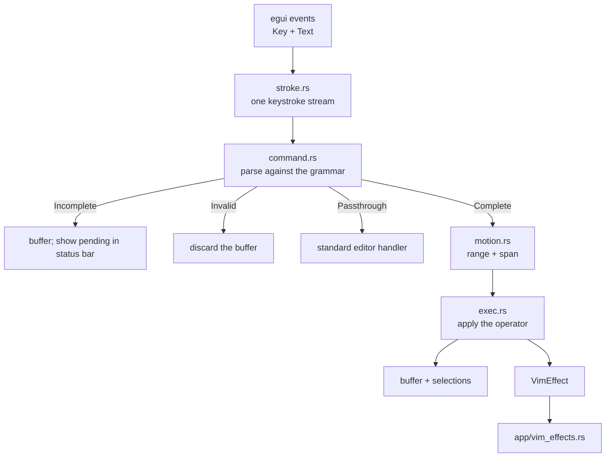

# Vim Mode

## Overview

Optional modal editing for FerriteEditor. Disabled by default to preserve standard editing.
When enabled it provides Normal / Insert / Visual / Visual Line / Command-Line modes, the
operator-motion grammar, text objects, registers, dot-repeat, and a subset of `:` commands.

The design and its rationale are in [`docs/VIM_MODE_DESIGN.md`](../../VIM_MODE_DESIGN.md).
This document is the as-built reference.

## Key Files

- `src/config/settings.rs` — `vim_mode: bool` setting (default: `false`)
- `src/editor/ferrite/vim/` — the pipeline:
  - `stroke.rs` — normalises `Event::Key` + `Event::Text` into one keystroke stream
  - `command.rs` — command types and the grammar parser
  - `motion.rs` — motions and text objects → range + span
  - `exec.rs` — ranges, put, join, indent, case, replace
  - `registers.rs` — the register file
  - `ex.rs` — `:` command parsing
  - `mod.rs` — `VimState`, the mode machine, dot-repeat, `VimEffect`
- `src/app/vim_effects.rs` — carries out app-level effects (save, quit, undo, search, `:set`)
- `src/editor/ferrite/editor.rs` — event interception, cursor-shape selection
- `src/editor/ferrite/rendering/cursor.rs` — `CursorShape::Bar` / `Block` rendering
- `src/editor/widget.rs` — `vim_mode` builder; `vim_effects` / `vim_pending` / `vim_cmdline`
  on `EditorOutput`
- `src/app/central_panel.rs` — collects effects, applies them after the tab borrow ends
- `src/app/status_bar.rs` — mode indicator and command line
- `src/state.rs` — `vim_mode_indicator`, `vim_command_line` on `UiState`

## Architecture

### The pipeline

### Why both event kinds are read

`egui::Key` has no variant for `$ ^ % * # ~ > < ( ) _`, and the variants it does have follow
the active keyboard layout. Printable characters therefore come from `Event::Text`, which is
layout- and IME-resolved; `Event::Key` supplies only non-printables and Ctrl chords.

**A `Key` event for a plain printable key is ignored in Normal/Visual mode.** egui emits both
a `Key` and a `Text` event for one press, so without that rule every command character would
be processed twice.

### Unrecognised input passes through

The parser returns `Incomplete` / `Complete` / `Invalid` / **`Passthrough`**. Anything the
grammar does not claim returns `Passthrough` and reaches the standard input handler. This is
what keeps app shortcuts alive in Normal mode, and it replaces the old `_ => Consumed`
catch-all that silently swallowed every unbound key — the cause of the dead arrow keys in
v0.3.0.

### Cursor shape follows the mode

Normal, Visual, Visual Line and Command-Line modes draw a **block** covering the character
under the cursor; Insert mode draws the usual **thin bar** between characters. That is the
distinction Vim users read to tell which mode they are in without looking at the status bar.

The block is painted in the cursor colour and the covered glyph is repainted in a contrasting
colour (chosen by Rec. 601 luma), so the character stays readable underneath. Its width is
the advance width of that character, so it lines up with proportional and CJK text; at end of
line, where there is nothing to cover, it falls back to half the font size.

`CursorShape` lives in `rendering/cursor.rs` and the decision is
`VimMode::uses_block_cursor()`. With Vim mode off, the cursor is always a bar — non-modal
editing is unaffected.

### Ctrl chords are left to the application

Only **`Ctrl+R`** (redo) is claimed. Vim's `Ctrl+D`/`Ctrl+U`/`Ctrl+F`/`Ctrl+B` scroll chords
are deliberately unbound, because Ferrite already uses `Ctrl+D` for Delete Line, `Ctrl+F` for
Find and `Ctrl+B` for Bold. Paging is on `PageUp`/`PageDown`.

## Implemented Commands

### Motions

| Keys | Action | Span |
|---|---|---|
| `h` `j` `k` `l`, arrows | Character / line | Excl / Linewise |
| `w` `W` `b` `B` | Word / WORD forward, back | Exclusive |
| `e` `E` `ge` `gE` | Word end, previous word end | Inclusive |
| `0` `^` `$` `g_` | Line start, first non-blank, end, last non-blank | Excl / Incl |
| `gg` `G` `{count}G` | First line, last line, goto line | Linewise |
| `f{c}` `F{c}` `t{c}` `T{c}` | Find character in line | Incl / Excl |
| `;` `,` | Repeat / reverse the last `f`-family motion | Incl / Excl |
| `{` `}` | Paragraph back / forward | Exclusive |
| `%` | Matching bracket | Inclusive |
| `H` `M` `L` | Screen top / middle / bottom | Linewise |
| `PageUp` `PageDown` | Page | Linewise |
| `+` `-` `<CR>` | First non-blank of next / previous line | Linewise |
| `n` `N` | Next / previous search match | — |
| `Home` `End` | Line start / end | Exclusive |

### Operators

Any operator combines with any motion or text object: `[register][count]op[count]target`.

| Keys | Action |
|---|---|
| `d` `y` `c` | Delete, yank, change |
| `>` `<` | Indent, dedent (`:set shiftwidth`, default 4) |
| `gu` `gU` `g~` | Lowercase, uppercase, toggle case |
| `dd` `yy` `cc` `>>` `<<` `guu` `gUU` | Doubled = linewise over `count` lines |
| `D` `C` `Y` `S` | To end of line / whole line shorthands |
| `s` | Substitute character |

### Text objects

`i{obj}` selects the inside, `a{obj}` includes the delimiters (and, for words, trailing
whitespace): `w` `W` `p` `"` `'` `` ` `` `(` `)` `b` `[` `]` `{` `}` `B` `<` `>`.

Examples: `ci"`, `dap`, `yi{`, `diw`, `daw`. Available in Visual mode too, where they extend
the selection.

### Other Normal-mode commands

| Keys | Action |
|---|---|
| `x` `X` | Delete character forward / backward |
| `r{c}` | Replace `count` characters |
| `~` | Toggle case of `count` characters |
| `J` `{count}J` | Join lines |
| `p` `P` | Put after / before |
| `u` `Ctrl+R` | Undo / redo (routed to the tab's history) |
| `.` | Repeat the last change, including text typed in the insert session |
| `*` `#` | Search for the word under the cursor |
| `{count}` prefix | Repeat; counts multiply (`2d3w` deletes six words) |

### Modes

| Keys | Action |
|---|---|
| `i` `a` `I` `A` | Insert before/after cursor, at first non-blank, at line end |
| `o` `O` | Open line below / above, matching the current indent |
| `v` `V` | Visual, Visual Line |
| `gv` | Reselect the previous visual range |
| `Esc` | Return to Normal |
| `:` `/` `?` | Command line, search forward / backward |

### Registers

`"a`–`"z` (uppercase appends), `"0` (last yank — untouched by deletes), `"-` (small delete),
`"1`–`"9` (shifting line deletes), `"_` (blackhole), `"+` / `"*` (system clipboard, write
only).

### Ex commands

| Command | Action |
|---|---|
| `:w` `:w {file}` | Save / Save As |
| `:wq` `:x` | Save and close the tab |
| `:q` `:q!` | Close the tab |
| `:qa` | Close the window (unsaved-changes prompt still runs) |
| `:e {file}` | Open a file |
| `:{n}` `:$` | Go to line |
| `:{range}d [reg]` `:{range}y [reg]` | Delete / yank lines |
| `:{range}s/pat/rep/[gi]` `:%s/…` | Substitute (uses the existing find/replace engine) |
| `:{range}>` `:{range}<` | Indent / dedent |
| `:noh` | Clear search highlight |
| `:set {opt}` `:set no{opt}` `:set {opt}!` `:set {opt}={n}` | `number`, `wrap`, `ignorecase`, `expandtab`, `tabstop`, `shiftwidth` |

Ranges accept `n`, `.`, `$`, `a,b` and `%`. An unknown command or option reports an error in
the status bar rather than silently doing nothing.

**Not supported, by design:** vimscript. No `:if`, `:function`, `:map`, or expression
evaluation.

## Not yet implemented

- **Visual Block** (`Ctrl+V`) and block insert. Ferrite's multi-cursor support makes this
  tractable; it is phase 5.
- **Macros** (`q{reg}` … `q`, `@{reg}`). Cheap now that strokes are first-class — record and
  replay the stream.
- **Marks** (`m{c}`, `` `{c} ``, `'{c}`) and command-line history.
- **`"+p`** — writing the clipboard works, reading it is not wired; `Ctrl+V` still pastes.
- **Sentence motions** (`(` / `)`) and `R` (replace mode).
- **Multi-cursor**: Vim commands act on the primary selection only. Other cursors stay put.
- **`smartcase`** — `:set ignorecase` is honoured, `smartcase` is not.

## Complexity

Per [`architecture.md`](architecture.md): character and word motions are O(log N); `%`,
paragraph motions and the bracket text objects are O(window), capped at `MAX_SCAN_LINES`
(200); `:%s` is O(N) but user-initiated. Nothing in the pipeline runs per-frame, the pending
stroke buffer and repeat counts are capped, and no path calls `buffer.to_string()`.

## Usage

1. Open Settings (gear icon or Ctrl+,)
2. In the Editor section, check "Vim Mode"
3. The status bar shows `[NORMAL]`, plus the pending command or open `:` line
4. Press `i` to insert, `Esc` to return to Normal
5. Uncheck the setting to return to standard editing
